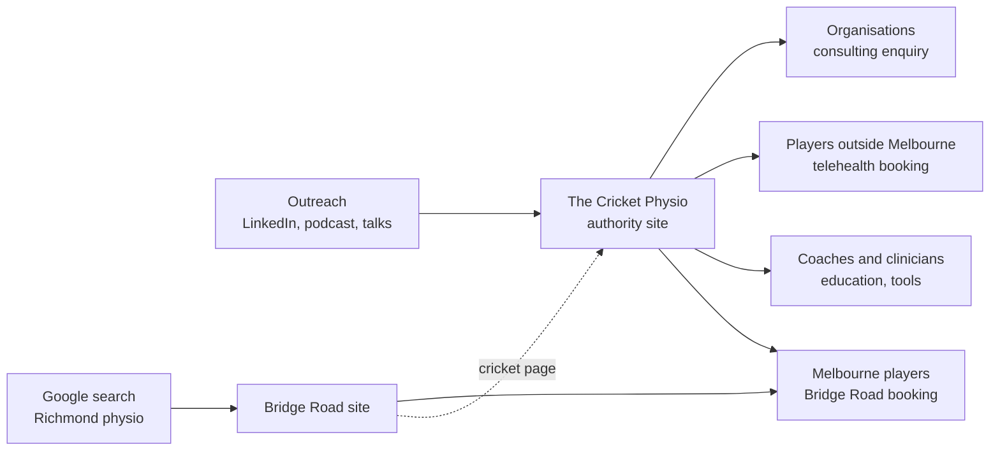
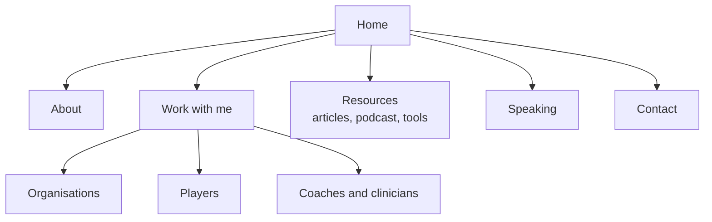

# The Cricket Physio: Website Map

Decisions locked 23 Sep 2026 · Thihan Chandramohan

## The positioning decision

The Cricket Physio is the person. Bridge Road Physiotherapy is the place. Build the site around that split and most of the wording problems go away.

The confusion comes from treating them as two businesses competing for the same reader. They aren't. They answer different questions:

- **The Cricket Physio** answers "Who is the cricket injury specialist, and what has he done?" It sells expertise, judgement and track record. It works across borders: Italy, telehealth, conferences, boards.
- **Bridge Road Physiotherapy** answers "Where do I get hands-on treatment in Melbourne?" It sells access, convenience and a room with a treatment table. It works within a few kilometres of Richmond.

So the Cricket Physio site is an authority site with a few paid doors, not a clinic site with a cricket skin. Its job is to make the right people want to work with you. Bridge Road is one of the places that work gets delivered.

**The one sentence that ties them together:** "In Melbourne, I see cricketers in person at Bridge Road Physiotherapy in Richmond." That line, placed in the right spots, does most of the bridging work.

**Decided:** mainly portfolio. The site's job is to make the right people want a conversation. Telehealth stays as a booking link on the Players page, with no packages or price tables. Education sits as free resources, not paid products. Revisit if paid offers become an income target.

## How the two fit together

Cricket Physio generates attention and trust. Bridge Road converts local demand into sessions. Traffic flows one way for in-person care and stays on Cricket Physio for everything else.

Read it left to right: Cricket Physio is where people arrive from your outreach, and it routes them to one of four doors. Bridge Road gets its own local search traffic and sends only cricket-specific interest back.

|  | The Cricket Physio | Bridge Road Physiotherapy |
| --- | --- | --- |
| Role | Personal brand, authority, outreach | Clinic, local care, bread and butter |
| Reach | National and international | Richmond and inner Melbourne |
| Voice | First person ("I") | Practice voice ("we" or "your physio") |
| Sells | Consulting, telehealth, education, tools | In-person physio sessions |
| Traffic source | LinkedIn, podcast, referrals, name search | Google Business Profile, local search, referrals |
| Physical address | None of its own | 507 Bridge Road, Richmond |
| Booking | Halaxy telehealth calendar | Halaxy clinic calendar |
| Success metric | Enquiries from the right organisations and players | New patients per week |

The "physical address" row matters for local SEO. Keep one address, attached to Bridge Road only. Cricket Physio says where you see people in person, but it does not present itself as a second clinic.

## Audiences

Five audiences, ranked by value to the brand. Build the site for the top two first; the rest get a clear path but less real estate.

| Priority | Audience | What they need to see in 10 seconds | Primary action |
| --- | --- | --- | --- |
| 1 | Organisations: national boards, state and club programs, academies, schools | Relevant roles (FCRI, SMA), systems thinking, what an engagement looks like | Book a scoping call |
| 2 | Players and parents, especially fast bowlers and juniors | You understand cricket loads and bowling injuries, and how to see you | Telehealth booking, or Bridge Road if in Melbourne |
| 3 | Coaches, S&C staff and clinicians | Practical, evidence-led resources and the workload tool | Request tool access, join mailing list |
| 4 | Event organisers and media | Speaking topics, bio, headshot | Speaking enquiry |
| 5 | Referrers: GPs, other physios, sports doctors | What you take on, how to refer | Referral contact |

**Why organisations sit first:** one consulting engagement is worth dozens of individual sessions, and they're the audience your credentials speak to most directly. They also check you out after a LinkedIn message, so the site has to hold up to a sceptical 60-second scan.

**Why players sit second, not first:** Melbourne players already have Bridge Road. Players elsewhere need telehealth, which is a smaller, harder sell. Serve them well, but don't let them shape the whole homepage.

**Opinion:** resist a separate page for every audience in version one. Three "work with me" doors (organisations, players, coaches and clinicians) cover almost every visitor.

## Messaging

Lead with cricket and credentials, then name the ways to work with you. Mention Bridge Road once on the homepage and once on the players page. No more.

**Positioning statement (internal, not site copy):** For cricket organisations, players and support staff who want fewer injuries and faster, safer returns, The Cricket Physio is Thihan Chandramohan's cricket-specific physiotherapy and sports medicine practice. Unlike general sports physios, it is built on international tournament experience and systems work with a national team.

**Hero line options**

| Option | Headline | Subline | Tone |
| --- | --- | --- | --- |
| A: Plain credential | Cricket physiotherapy, from club nets to World Cups | Head of Sports Science and Sports Medicine, Federazione Cricket Italiana | Safe, clear, strongest for organisations |
| B: Outcome | Keeping cricketers on the park | Injury prevention, rehab and workload planning for players, teams and programs | Warmer, broader, weaker on proof |
| C: Name-led | Thihan Chandramohan. The Cricket Physio. | Physiotherapist working with national teams, clubs and players | Best if name search is the main traffic |

**Decision: option B.** "Keeping cricketers on the park" is warmer and speaks to players and coaches. It carries less proof, so the credentials must sit directly under it: FCRI and SMA roles in a roles strip right below the hero. Use C's name-led structure in the page title and meta description so name searches still land.

**Bridge Road wording, by context**

- Homepage, one line near the players door: "In Melbourne? I see cricketers in person at Bridge Road Physiotherapy in Richmond."
- Players page, a short section: "In-person care in Melbourne. My clinic, Bridge Road Physiotherapy, is where I do hands-on assessment and gym-based rehab. Book a cricket consult there."
- About page, one sentence: "I also run Bridge Road Physiotherapy, a clinic in Richmond focused on return to activity."
- Footer: "In-person consults: Bridge Road Physiotherapy, Richmond VIC."

**Phrases to avoid**

- "Elite", "world-class", "leading": unverifiable and AHPRA-risky, and off-brand for you.
- Any wording that implies Cricket Physio is a separate clinic ("visit our clinic").
- Outcome promises ("get back to bowling in 6 weeks").
- Team or player endorsements framed as testimonials. State roles factually instead.

## Sitemap and page map

Eight pages for version one. Everything else waits until the core converts.

| Page | Job | Must include | Primary CTA |
| --- | --- | --- | --- |
| Home | Establish credibility in one scroll, route to the right door | Hero (option B), roles strip (FCRI, SMA), three doors, one Bridge Road line, latest resource | Pick your door |
| About | Prove you're the real thing without bragging | Portrait, short story, roles with dates, qualifications, the Bridge Road sentence | Work with me |
| Organisations | Sell consulting and SSSM work | Problems you solve, engagement types (audit, program build, tournament support), how it runs, a brief case summary with permission | Book a scoping call |
| Players | Get players to the right booking | Common cricket injuries you see, telehealth option, in-person option at Bridge Road, what to expect in session one | Book telehealth / Book at Bridge Road |
| Coaches and clinicians | Build the list and seed tool users | Free resources and downloads, a short note that the workload tool is coming | Join the list for the tool launch |
| Resources | Show your thinking; feed SEO and outreach | Articles, podcast episodes, filter by audience | Subscribe |
| Speaking | Make booking you easy | Topics: injury prevention, lumbar bone stress injuries in fast bowlers, throwing injuries, return to performance; past talks, bio in two lengths, headshot download | Speaking enquiry |
| Contact | Route enquiries | Short form with an "I am a..." selector that tags the lead | Send |

**Build notes**

- The "I am a..." selector on Contact (organisation, player or parent, coach or clinician, media, other) lets you triage without reading every message.
- Players page needs two booking buttons side by side, clearly labelled by location. This matches your separate Halaxy calendars.
- Workload tool launches after the site. When it does, copy says "request access", not "sign up".
- FCRI is fine to name. Still get sign-off on each case summary before it goes live, and keep player details out.
- Skip a blog-first launch. Two or three strong pieces beat a thin archive.

## Cross-linking rules

Link deliberately and sparingly. Each site keeps its own content; neither copies the other's pages.

| Where | Rule |
| --- | --- |
| Cricket Physio: Home, Players, About, footer | Link to Bridge Road's cricket booking page, not its homepage |
| Bridge Road: one "Cricket injuries" page | Short local page (Richmond, in-person) that links to Cricket Physio for depth, resources and telehealth |
| Bridge Road: About Thihan | One line naming The Cricket Physio and your FCRI role, linked |
| Google Business Profile | Bridge Road only. Cricket Physio gets no GBP listing and no address |
| Halaxy | Two calendars, two booking links. Cricket Physio link = telehealth. Bridge Road link = in-person, with a "cricket consult" service type |
| Tracking | UTM tags on every cross-link (e.g. utm_source=cricketphysio) so you see how many bookings Cricket Physio sends to the clinic |
| Social bios | @thecricketphysio points to Cricket Physio home. Bridge Road's Instagram (if any) points to Bridge Road |
| Content | Write once on Cricket Physio. Bridge Road links to it rather than republishing, to avoid duplicate content |

**Visual link:** keep the brands distinct. Cricket Physio uses its teal crest; Bridge Road keeps green and ochre. A small "In-person at Bridge Road Physiotherapy" badge using Bridge Road's logo is enough to signal the connection.

## Build order, risks and decisions

Ship Home, About, Organisations and Players first. Those four carry the outreach job. The rest follow once the first four are live.

**Build order**

1. Lock the hero line and the Bridge Road sentence (done, see above).
2. Home, About, Organisations, Players, Contact.
3. Set up the Halaxy cricket consult service at Bridge Road and the telehealth calendar; wire both buttons.
4. Add the "Cricket injuries" page on the Bridge Road site with its link back.
5. Coaches and clinicians page. Add the workload tool access request when the tool launches.
6. Resources with two or three launch pieces, then Speaking.
7. UTM tags and GTM events on every booking and enquiry button.

**Risks**

- **Two sites, one person, no admin support.** Every page you add is a page you maintain. Eight pages is the ceiling for now.
- **Brand blur.** If Cricket Physio starts listing general physio services, it competes with Bridge Road and weakens both. Keep it cricket only.
- **AHPRA.** Both sites fall under the same advertising rules. No testimonials about clinical care, no outcome claims, no "specialist" title unless you hold specialist registration. "Cricket physio" as a brand name is fine; "cricket specialist" in copy is the line to watch.
- **Competitor overlap.** Cricket Matters (UK) occupies similar ground. Your edge is the combination of national-team systems work and a real clinic. Say both plainly.
- **Telehealth scope.** Remote assessment has limits. Say what telehealth suits and when you'll send someone to an in-person physio or a doctor.

**Decisions made**

- [x] Site role: mainly portfolio, no priced offers
- [x] Hero line: option B, credentials directly below
- [x] FCRI: fine to name and describe the work
- [x] Speaking topics: injury prevention, lumbar bone stress injuries in fast bowlers, throwing injuries, return to performance
- [x] Workload tool: launches after the site
